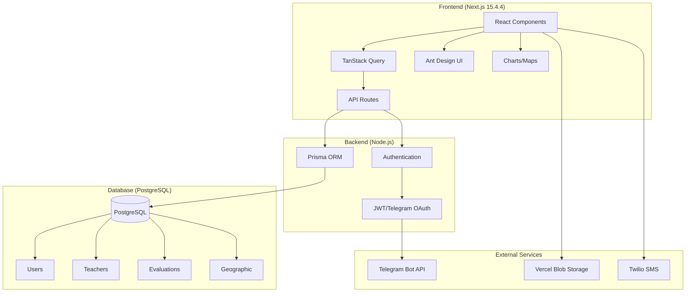
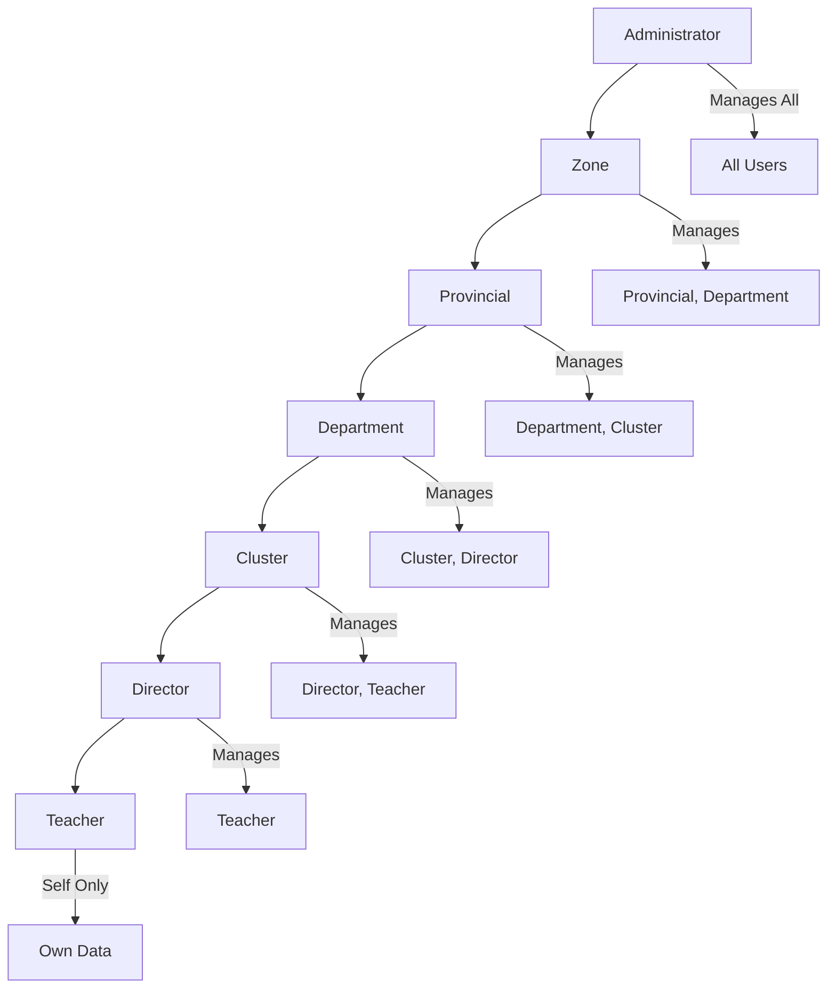
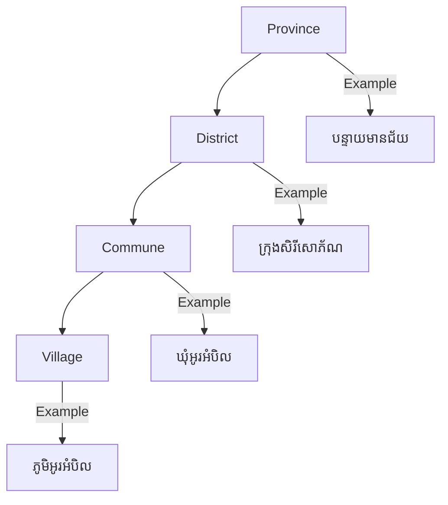
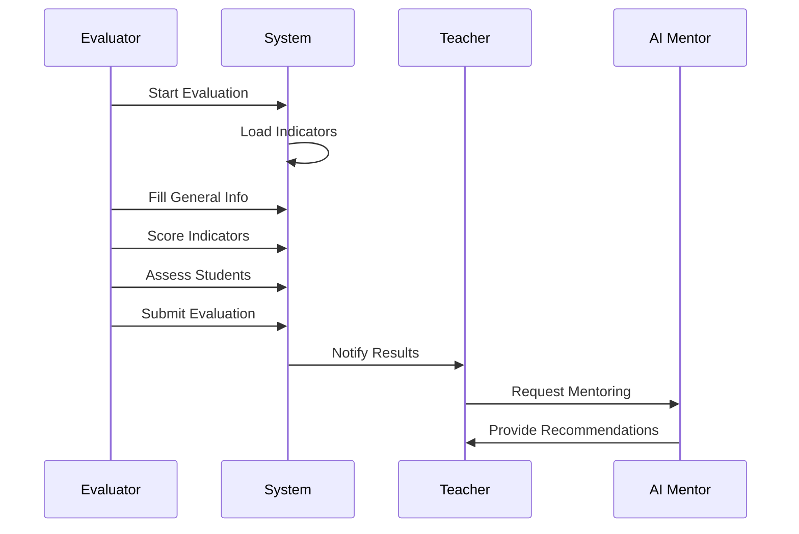

# Teacher Observation Tool

A comprehensive teacher evaluation and mentoring system for grades 4-6 in Cambodia.

## 🏗 Architecture Overview



## 🔐 Role-Based Access Control



## 🌍 Geographic Hierarchy



## 📊 Evaluation Flow



## 🚀 Getting Started

### Prerequisites

- Node.js 18+
- PostgreSQL 14+
- Telegram Bot Token (for OAuth)
- Twilio Account (for SMS)

### Installation

1. Clone the repository:
```bash
git clone <repository-url>
cd teacher-observation
```

2. Install dependencies:
```bash
npm install
```

3. Set up environment variables:
```bash
cp .env.example .env
# Edit .env with your configuration
```

4. Run database migrations:
```bash
npm run prisma:migrate
npm run prisma:seed
```

5. Start the development server:
```bash
npm run dev
```

### Docker Setup

```bash
docker-compose up -d
```

## 📱 Features

### Core Features
- ✅ Teacher evaluation forms with Khmer/English support
- ✅ Multi-level role-based access control
- ✅ Cascading geographic filtering
- ✅ Telegram OAuth authentication
- ✅ Real-time sync status
- ✅ Offline support (PWA)
- ✅ AI-powered mentoring chat
- ✅ Data export (Excel, CSV)

### Dashboard Features
- 📊 Real-time analytics
- 📈 Progress tracking by region
- 🗺️ Interactive maps with Leaflet
- 📱 Mobile-responsive design

### Security Features
- 🔐 JWT authentication
- 🔑 Telegram OAuth integration
- 🛡️ Role-based permissions
- 📝 Audit logging

## 🗂 Database Schema

The system uses PostgreSQL with the following main tables:

- **users**: System users with roles and geographic assignments
- **teachers**: Teacher profiles
- **evaluation_sessions**: Evaluation records
- **indicators**: Main evaluation categories
- **sub_indicators**: Specific evaluation criteria
- **evaluation_scores**: Individual scores for each indicator
- **student_assessment**: Sample student evaluations
- **ai_chat_sessions**: AI mentoring conversations
- **geographic**: Province/District/Commune/Village hierarchy

## 🛠 Tech Stack

### Frontend
- **Framework**: Next.js 15.4.4 with App Router and Turbopack
- **UI Library**: Ant Design v5.26.6
- **State Management**: TanStack Query v5.83.0
- **Charts**: Recharts v3.1.0, ECharts v5.6.0
- **Maps**: Leaflet v1.9.4

### Backend
- **Runtime**: Node.js
- **Database**: PostgreSQL with Prisma ORM v6.12.0
- **Authentication**: JWT + Telegram OAuth
- **APIs**: RESTful with Next.js API Routes

### External Services
- **Storage**: Vercel Blob
- **Messaging**: Telegram Bot API, Twilio SMS
- **PWA**: next-pwa with Workbox

## 📄 API Documentation

### Authentication Endpoints
- `POST /api/auth/login` - Email/password login
- `POST /api/auth/telegram` - Telegram OAuth
- `POST /api/auth/logout` - Logout

### Geographic API
- `GET /api/geographic/provinces` - List all provinces
- `GET /api/geographic/districts?provinceId=X` - Districts by province
- `GET /api/geographic/communes?districtId=Y` - Communes by district
- `GET /api/geographic/villages?communeId=Z` - Villages by commune

### Evaluation API
- `GET /api/evaluations` - List evaluations
- `POST /api/evaluations` - Create evaluation
- `GET /api/evaluations/:id` - Get evaluation details
- `PUT /api/evaluations/:id` - Update evaluation

## 🤝 Contributing

1. Fork the repository
2. Create your feature branch (`git checkout -b feature/AmazingFeature`)
3. Commit your changes (`git commit -m 'Add some AmazingFeature'`)
4. Push to the branch (`git push origin feature/AmazingFeature`)
5. Open a Pull Request

## 📝 License

This project is licensed under the MIT License.